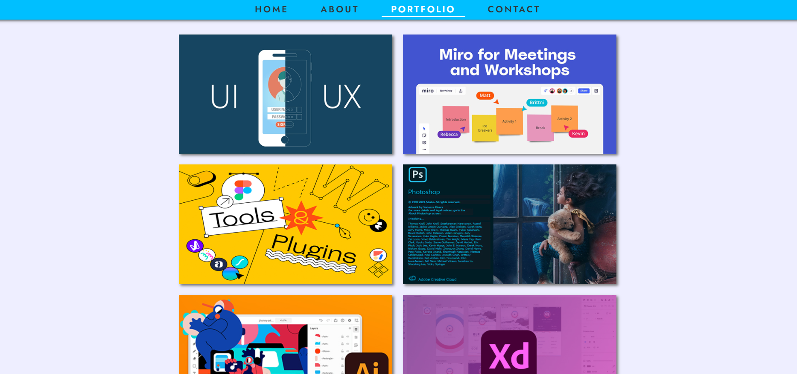

# portfolio

This is a UX Design Portfolio project that I made using HTML, CSS, and Javascript. This is a display of beautiful grid system and colorgraphy, along with CSS animation that adds a layer of elegance to the website. The website is responsive, and I learned how to utilize DOM manipulation to respond to different requests on the site.

